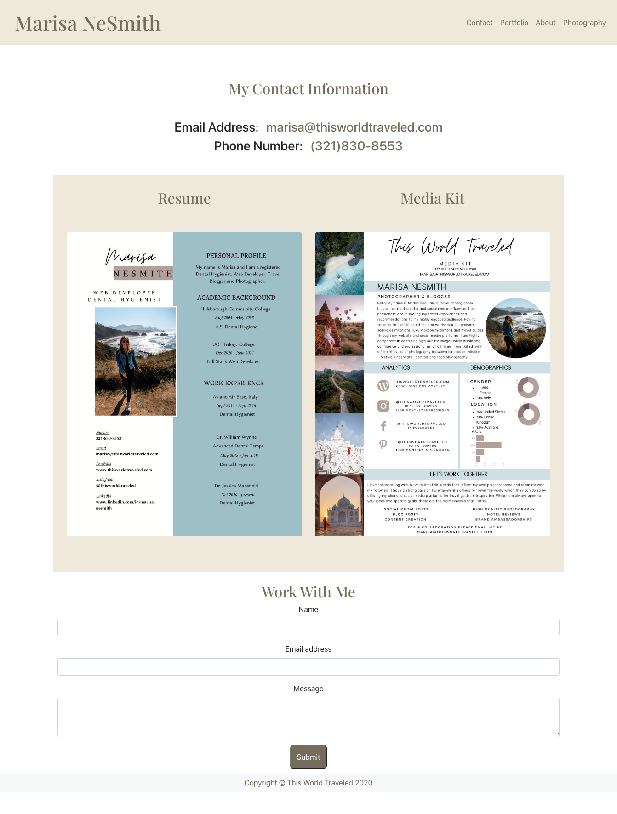

# Marisa NeSmith React Portfolio

## Table of Contents
* [Project Overview](#Project-Overview)
* [Application](#Application)
* [Installation](#Installation)
* [License](#License)
* [Questions](#Questions)

## Project Overview

A personalized portfolio built with react as a way to display my coding projects and photography. There is also a contact page where future Employers can view my resume, media kit and contact me. 

## Application
[Live GitHub pages link](https://marisanesmith.github.io/marisa-nesmith/)

## Installation

To properly run this application you will need to first install your React app by entering npx react-create-app (app name) into your terminal. This will automatically install all the dependencies necessary. Cd into the React app that you created and then enter npm start in your terminal to open your application in your browser. 

After that is complete you will need to deploy the application to Heroku or a similar hosting site to view your react portfolio online. 

## License

You can find out more about the MIT license on the open source page [here](https://www.opensource.org/licenses/MIT)

## Questions

Please contact me via email if you have any questions about this application.

* GitHub Profile: [github.com/marisanesmith](github.com/marisanesmith)

* Email: [marisanesmith@yahoo.com](marisanesmith@yahoo.com)
